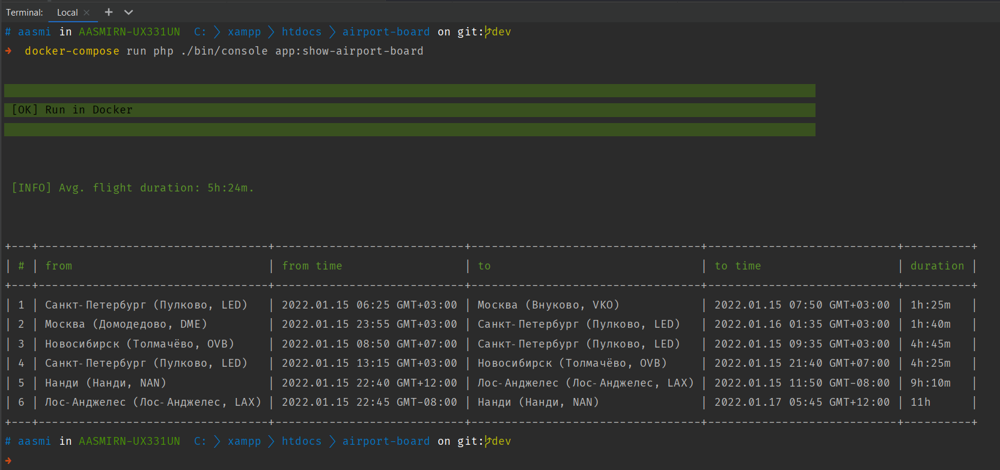

# Тестовое задание для php разработчика

## Результат работы
1) Смирнов Алексей Анатольевич
2) ~2 часа, с учетом небольших отвлекающих перерывов
3) Скриншот результата:



## Решение
Для определения продолжительности полета использовались только значения
времени вылета и прибытия без учета даты и временной зоны. 
Для правильных вычислений я решил использовать данные в виде объекта DateTime
уже с учетом и даты и времени и временной зоны.  

Для этого было:
* добавлено поле timezone в сущность Airport;
* в сущности Flight строковые поля $fromTime и $toTime были заменены на 
объекты DateTime;
* во FlightRepository было добавлено получение дат вылета/прилета, timezone аэропортов
и дальнейшее преобразование этих данных в DateTime объект, который передавался во Flight;
* во Flight был изменен private метод, который высчитывал продолжительность полета.
Результат стал верным, без изменения формата (результат выдается как количество минут);
* в ShowAirportBoardCommand были обновлены методы получения даты/времени вылета и отправки, 
добавлена возможность указания удобного формата вывода.


## Описание
### Легенда
Представим, что наша компания разрабатывает аналитическую систему авиаперелетов. Ваша команда выпустила первую версию продукта. В этой версии система получает данные из json файлов (airport.json и flight.json), объединяет их и высчитывает несколько дополнительных значений. Получившийся результат выводится в консоли.

### Результаты тестирования
Отдел тестирования выявил следующие баги:
* Информация о рейсе из Санкт-Петербурга в Москву (строчка 1) выглядит правильной, но обратные рейс (строчка 2) имеет отрицательную продолжительность, что невозможно.
* Рейсы из Новосибирска в Санкт-Петербург и обратно (строчки 3 и 4) имеют положительную продолжительность, но отличающуюся друг от друга на порядок. Поскольку расстояние между городами не зависит от направления полета, то продолжительность полетов должна быть схожа (одного порядка).
* Рейсы из Нанди в Лос‑Анджелес и обратно (строчки 6 и 7) имеют отрицательную продолжительность, что невозможно.

## Задачи
* Устранить все неисправности.
* Улучшить вывод информации, чтобы облегчить работу нашим QA инженерам и аналитикам. Сейчас не совсем очевидно из каких значений высчитывается продолжительность полета.
* Объяснить причины ошибок и принятые решения.

# Результат
Результат тестового задания должен содержать:

1. ФИО автора.
2. Потраченное на тестовое задание время.
3. Скриншот вывода консольной команды.
4. Код, оформленный в виде git репозитория, который содержит несколько коммитов, показывающих ход вашей работы.
5. Описание принятых решений.

Примечание:
* Репозиторий вы можете разместить на любом публичном хостинге репозиториев (GitHub, BitBucket) и скинуть нам ссылку на него.
* Текстовые описания можно сделать в README.md файле вашего репозитория.
* Описание принятых решений необходимо сделать в свободной форме, словно вы рассказываете другому разработчику, который хотел узнать, чем вы занимались на прошлой неделе.
* Скриншот можно прикрепить к ответному письму.

## Что мы хотим увидеть
* Понятные объяснения.
* Чистый код.
* Уверенное владение git.

# Запуск
**Необходимо** установить Docker (https://docs.docker.com/get-docker/) и Docker Compose (https://docs.docker.com/compose/install/).

Перед запуском консольных команд убедитесь, что Docker запущен.
```bash
docker-compose run php ./composer.phar install # Установка зависимостей
docker-compose run php ./bin/console app:show-airport-board  # Отображения табло полетов
```

За консольную команду `app:show-airport-board` отвечает класс \App\Command\ShowAirportBoardCommand.

Стек технологий:
* Проект написан на php 8.1
* Для управления зависимостями используется Composer (https://getcomposer.org/)
* Для запуска генерации через CLI команду используется symfony/console (https://symfony.com/doc/current/components/console.html)
* Для dev окружения используется Docker (https://www.docker.com/) и Docker Compose (https://docs.docker.com/compose/)